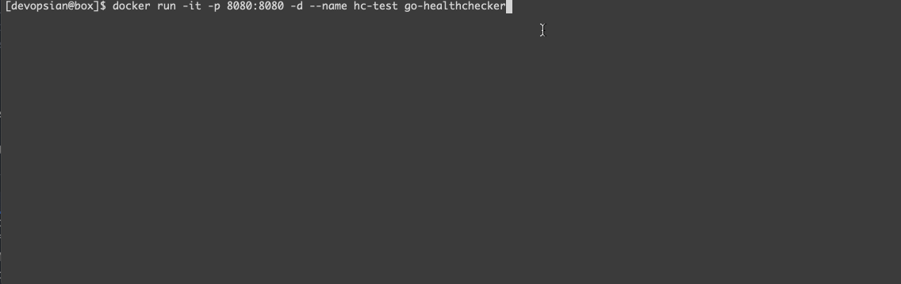
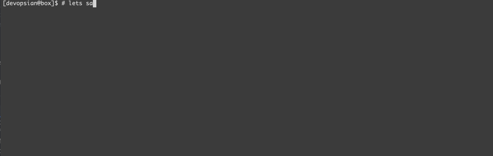

# Docker Go Healthchecks App [](https://devopsian.net/notes/docker-healthcheck-app/)

This repository is to experiment docker's HEALTHCHECK feature. You can (and should) configure HEALTHCHECK
for your app. Docker will periodically run these checks and can take action if a container becomes unhealthy.

It contains a small web app written in Go that exposes `/health` endpoint. It has a small API, that can change its health status.

* `/sabotage` will make it respond with 500.
* `/timeout` will make it respond after 20s.
* `/recover` will return it back to healthy state, with 200 response code.

From Docker [docs](https://docs.docker.com/engine/reference/builder/#healthcheck) -

```
The HEALTHCHECK instruction has two forms:

    HEALTHCHECK [OPTIONS] CMD command (check container health by running a command inside the container)
    HEALTHCHECK NONE (disable any healthcheck inherited from the base image)

The HEALTHCHECK instruction tells Docker how to test a container to check that it is still working. This can detect cases such as a web server that is stuck in an infinite loop and unable to handle new connections, even though the server process is still running.

When a container has a healthcheck specified, it has a health status in addition to its normal status. This status is initially starting. Whenever a health check passes, it becomes healthy (whatever state it was previously in). After a certain number of consecutive failures, it becomes unhealthy.
```

The options that can appear before CMD are:

    --interval=DURATION (default: 30s)
    --timeout=DURATION (default: 30s)
    --start-period=DURATION (default: 0s)
    --retries=N (default: 3)

## Demo

1. Clone the repo and build the image: `docker build . -t go-healthchecker`

2. Bring up the container, wait until it gets healthy.



3. To change the healthcheck response, connect to the container and update its status



